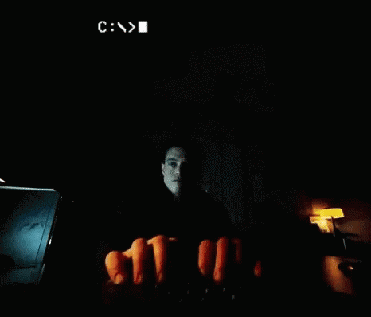

<h3 align="center">I'm an enthusiastic Learner in Data Science & Machine Learning ❤</h3>  

<p align="center"> Currenty working as a Jr. Data Analyst at sheba.xyz. I'm a Dreamer who loves to watch dream and work hard for make it happen. I'm Looking forward to building a challenging career in the Data Science industry by utilizing my expertise and knowledge gained from years of competitive programming, problem-solving, and academic studies. 🚀 </p>

</br>



- ⚡ I'm currently working as a Business Intelligence Analyst at 10 Minute School.
- 🔭 I’m currently working on Disease classification using Machine Learning technique.
- 🌱 I’m currently learning more about Deep Learning methods.
- 👯 I’m looking to collaborate on data science and deep learning projects.
- 🥅 Goals: Becoming a world leadning Data Scientist in the next 5 years.
- 📝 Have a look at my [Resume](https://drive.google.com/file/d/1dUMLbH9io0RV3ZZx-NpDD4ltXGqMrhr5/view?usp=sharing) for more details about me. I'm open for any valuable suggestions!


## 🏆 Github Status


<!--  -->


## 👨‍💻 Languages and Tools

<div align="center">
  


</div>
<br /> <br />
  
### 💬 My Stacks

```json
{
  "Languages and Frameworks": ["Python", "Django", "OpenCV", "PHP", "C (basic)", "HTML", "CSS", "Bootstrap"],
  "Data-Science": {
    "Predictive Analysis & Algorithm Development": ["Scikit-Learn"],
    "Data Visualization": ["Pandas", "Matplotlib", "Seaborn"],
    "Machine Learning": ["Statistical Analysis", "Linear/Logistic Regression","Clustering"],
    "Deep Learning": ["Keras", "TensorFlow", "Computer Vision", "Transfer Learning"],
    "Data Annotation": ["LabeIlmg","Labelme"]
  },
  "Database": ["MySQL", "SQL","PostgreSQL"],
  "Operating System": ["Linux","Windows", "Android"],
  "Tools": ["Metabase", "Data Studio", "Jupyter Notebook","PyCharm","Visual Code","Adobe Photoshop"] 
}
```

<div align="center">

### Also find me in - 


[](https://https://www.linkedin.com/in/niloy--biswas/) 
[](https://www.facebook.com/Niloy.swe/) 
[](https://mail.google.com/mail/?view=cm&fs=1&to=niloy.swe@gmail.com)
[](https://www.kaggle.com/niloyswe) 
[](https://www.researchgate.net/profile/Niloy_Biswas4) 
  
<div/>


